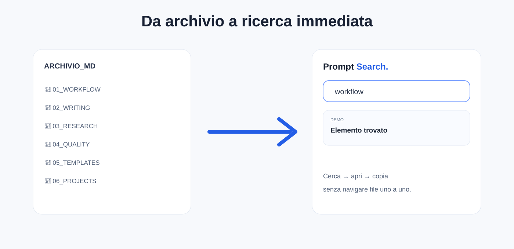
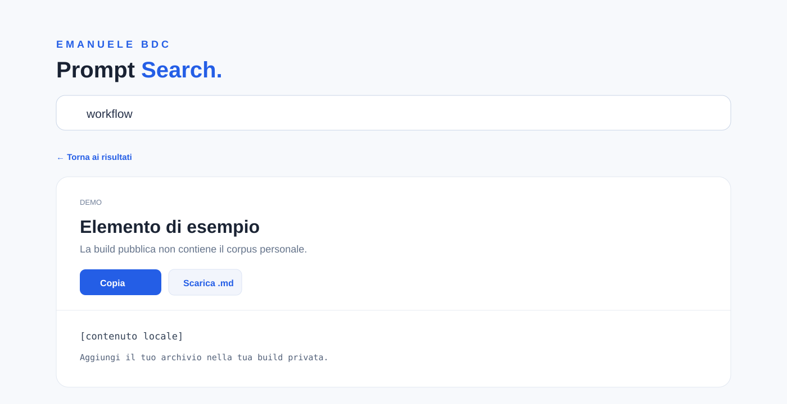

<p align="center">
  
</p>

# Prompt Search.

**Il problema non è avere tanti prompt. È ritrovare quello giusto quando serve.**

Prompt Search nasce da un archivio personale cresciuto nel tempo: cartelle, sottocartelle e centinaia di file Markdown. Ordinato, ma sempre meno rapido da usare.

Quando serve un prompt al volo, il percorso classico è inutile: ricordare la cartella, trovare il file, aprirlo, controllarlo, copiarlo.

Volevo qualcosa di più semplice:

**CERCA → APRI → COPIA → USA**

## L'idea

Prompt Search trasforma un archivio di file Markdown in una **pagina HTML locale**, pensata per cercare e raggiungere rapidamente ciò che serve.

<p align="center">
  
</p>

Niente backend, database, API o account. Il progetto può essere aperto direttamente nel browser e funziona offline.

## Cosa fa

- ricerca nei titoli e nei contenuti;
- vista principale e archivio completo;
- navigazione per categorie;
- apertura del contenuto in una vista leggibile;
- copia negli appunti;
- download del singolo elemento come `.md`;
- Preferiti e Cestino salvati nel browser;
- export dei Preferiti;
- backup dell'HTML.

<p align="center">
  
</p>

## Perché un singolo HTML

La scelta è intenzionale: **portabilità prima di tutto**.

L'interfaccia, il CSS e il JavaScript vivono nello stesso file. Non servono installazione, dipendenze o configurazione.

```text
PROMPT_SEARCH.html
WIDGET_APRI_RICERCA.html
```

Apri `PROMPT_SEARCH.html` nel browser e l'app è pronta.

Su Mac, `WIDGET_APRI_RICERCA.html` può essere usato come lanciatore rapido tramite un alias sulla Scrivania o nel Dock. Non è un widget nativo macOS.

## Perché questa repository non contiene prompt

La versione che uso personalmente contiene un archivio reale di centinaia di prompt. **Quel contenuto non fa parte di questa repository.**

La build pubblica distribuisce intenzionalmente:

- l'interfaccia;
- il motore di ricerca;
- le funzioni locali;
- la struttura del progetto;
- **zero prompt del mio archivio personale**.

Nel sorgente pubblico, `prompt-data` è vuoto.

Questo separa il progetto dal contenuto che gestisco con il progetto.

## Nota tecnica

Prompt Search è uno **snapshot**: non osserva automaticamente una cartella del computer e non sincronizza in tempo reale i file Markdown.

I dati devono essere incorporati nell'HTML quando si costruisce il proprio archivio. Le operazioni effettuate nell'interfaccia non modificano i file `.md` originali.

## Privacy

Nessun account richiesto. Nessuna API richiesta. Nessuna telemetria aggiunta dal progetto. I dati caricati nella propria build restano nel file/browser utilizzato localmente.

---

Made with ♥ in Milan by **Emanuele BDC**
